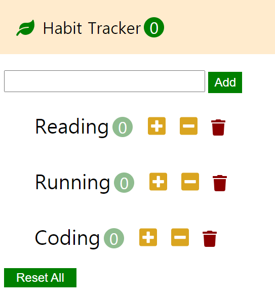

# Habit Tracker

## About The Project



 취미 목록 추가, 각 취미별 횟수 조절, 횟수가 1 이상인 취미의 갯수 표시, 목록 삭제 기능을 만들어보며 Vue의 v-bind, v-model, props, emit 등 여러 기능과 활용법을 공부한 프로젝트 입니다.

## Built With

* Vue.js
* Fontawesome

## Getting Started

 로컬환경에서 프로젝트를 실행시켜보기 위한 방법입니다.

### Prerequisites

 npm module이 사용됩니다.

* npm 설치

  [node.js 공식사이트](https://nodejs.org/en/)


### Installation

* Install NPM packages

  ```bash
  npm install
  ```

### Start

```bash
npm run serve
```

